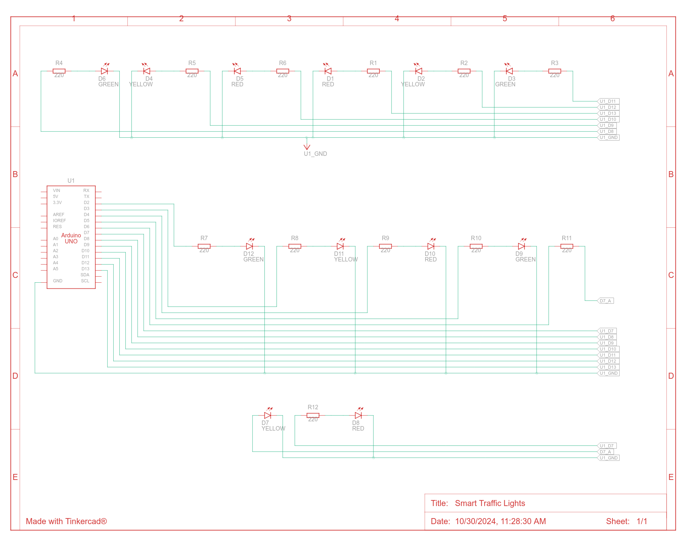

# Smart Traffic Lights

A simple Arduino project that simulates a traffic light system using LEDs.

## Project Proposal
[project_proposal.pdf](./project_proposal.pdf)

## Components

Below is the bill of materials (BOM) for this project:

| Name                                              | Quantity | Component      |
|:--------------------------------------------------|---------:|:---------------|
| ESP32                                             |        1 | ESP32S         |
| L1, L4                                            |        2 | Red LED        |
| L2, L5                                            |        2 | Yellow LED     |
| L3, L6                                            |        2 | Green LED      |
| R                                                 |        6 | 220 Ω Resistor |
| CAMERA #1, CAMERA #2                              |        2 | Web Camera     |
| SERVER                                            |        1 | LAPTOP         |
| USB #1, USB #2                                    |        2 | USB Hosts/Ports|

## Circuit Design

The image below shows the circuit design for this project. It includes wiring for LEDs representing red, yellow, and green lights, each connected to appropriate resistors to limit current and protect the components.

## How to Run

1. Connect the components as shown in the circuit design image.
2. Change the input pins respectively.
3. Upload the code to your Arduino/ESP.
4. The lights start to work automatically
5. You can change the green light time for each traffic light by inputting `green1: %d` or `green2: %d` respectively.

## Simulation Link

You can view and simulate this project on Tinkercad using the link below:

[Tinkercad Smart Traffic Lights Simulation](https://www.tinkercad.com/things/hdudYbIVgy7-daring-bombul)

